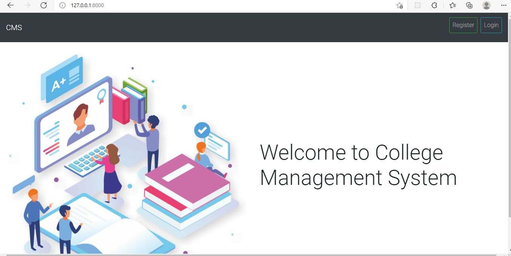
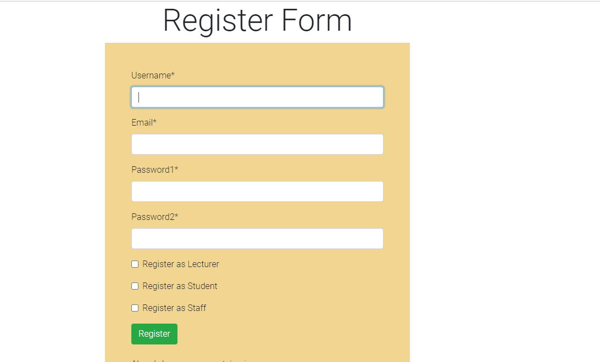
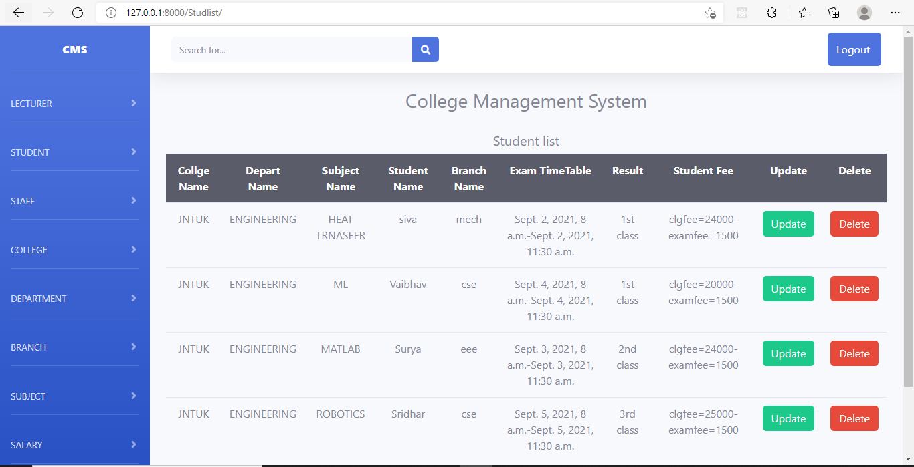

 
#College_Management_System

You should create a Environment

$ virtualenv "name of the file"

$ activate the environment

$ pip install -r requirements.txt 

$ python manage,py runserver

###  HomePage

###Register Page

###DashBoard_Crud

